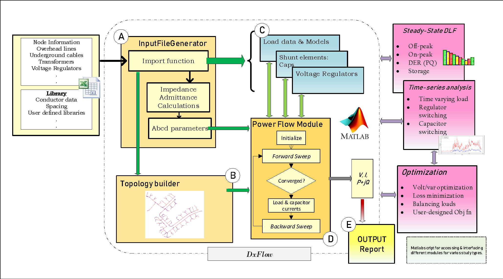

# DxFlow
Open-Source Poly-Phase Distribution load flow simulation tool

## Modules in DxFlow  ##

**A. Input File Generator**
* **InputFileGeneratorR8.m**
* A Preprocessor- Imports raw data consisting of distribution elements, load data and process to multidimensional array
* Series elements- OH lines, cables, regulators, transformers data are computed to ABCD/abcd parameters
* *Other functional modules*
    * *Spacingalg.m* 
    * *conver2rec.m*
   

**B. Topology Builder**
* **TreeAlgR6.m**

**C. Load Model Initialization**
* **LoadnCap.m**

**D. Power Flow Modules**
* **ThreePhLF.m** or **PowerFlow.m**
* *Other functional modules*
  * *VoltReg.m*
  * *Caps.m*
  * *conver2rec.m*
  

**E. Recording Modules**
* **OutputFileGenerator.m**

